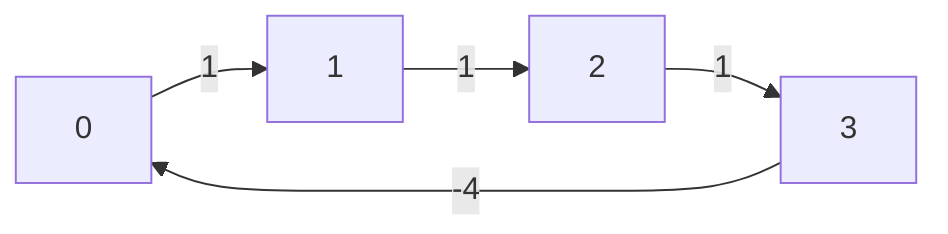

# Bellman Ford Algorithm

<div class="video-reveal" data-video-id="FtN3BYH2Zes">
  <button type="button" class="video-reveal__trigger" aria-label="Watch the video tutorial">
    <span class="video-reveal__title">Watch the video tutorial</span>
    <span class="video-reveal__play-icon" aria-hidden="true">
      <svg viewBox="0 0 24 24" fill="currentColor"><path d="M8 5v14l11-7z"/></svg>
    </span>
  </button>
</div>


BFA or Bellman Ford algorithm is used to find shortest path from the source node to all the nodes in the graph.

It works by first assigning a distance value of \(\infty\) to all the nodes except the source node where the distance value is set to \(0\).

Later, for \(n-1\) times, where \(n\) is the total number of nodes, we iterate over all the edges to reduce the distance from source to all the destination nodes.

***Why only \(n-1\) times?*** - Because the farthest from the source node can be covered in \(n-1\) edges and cannot be relaxed further.

BFA also helps us in determining a cycle in graph negative weights. If we run the iteration over edges \(n\) times and on the \(n\)th step, if any node still got relaxed, this concludes that the graph has cycle with negative weights.

## Time Complexity

\(O(n \times m)\) where \(n\) is number of nodes and \(m\) is number of edges.

## Limitations

- BFA does not work on graphs containing **negative weight edge cycles** because with negative weight in a cycle we can relax the distances infinitely to any destination node.

## Input

- Number/Set of nodes.
- Set of edges in tuple of \((a, b, w)\) where \(a\) is source, \(b\) is destination and \(w\) is the edge weight between \(a\) and \(b\).

## Algorithm

### Directed Graph

=== "Java"

    ```java linenums="1"
    public class BellmanFord {
        public static int[] getShortestPathDistances(int source, int n, int[][] edges) {
            int[] distances = new int[n];

            for (int i = 0; i < n; ++i) {
                distances[i] = Integer.MAX_VALUE;
            }
            distances[source] = 0;

            for (int v = 0; v < n - 1; ++v) {
                boolean relaxedInStep = false;
                for (int[] edge : edges) {
                    int a = edge[0];
                    int b = edge[1];
                    int w = edge[2];
                    if (distances[a] != Integer.MAX_VALUE && distances[b] > distances[a] + w) {
                        relaxedInStep = true;
                        distances[b] = distances[a] + w; // update the shortest distance
                    }
                }
                if (!relaxedInStep) {
                    break; // exit, as no node was relaxed
                }
            }

            return distances;
        }
    }
    ```

### Undirected Graph

The above algorithm works well for any directed graph where each edge represented as \([a, b, w]\) has an edge from \(a\) to \(b\) with a weight of \(w\). The relaxation will happen from \(a\) to \(b\). However, for an undirected graph, the relaxation can happen from both \(a\) to \(b\) as well as \(b\) to \(a\). In this case, we need to process both direction.

To achieve this, we can simply update the edges list to include extra edge definition from opposite direction into the edges list.

=== "Java"

    ```java linenums="1"
    public class BellmanFord {
        public static int[] getShortestPathDistances(int source, int n, int[][] edges) {
            // add new edges
            List<int[]> expandedEdges = new ArrayList<>();
            for (int[] edge : edges) {
                expandedEdges.add(new int[]{e[0], e[1], e[2]});
                expandedEdges.add(new int[]{e[1], e[0], e[2]});
            }

            // ... same as above algorithm by replaces edges with expandedEdges
        }
    }
    ```

### Negative Weight Cycle

A negative weight cycle in a graph is a cycle having path starting and ending on same node and having a negative weight edge in it.

Take for example the following diagram.



BFA algorithm has limitation against solving shortest path in a graph having negative weight cycle as during iteration, the edge having negative weights can be iterated infinite times to relax a given node's distance.

BFA can help us in identifying a graph having a cycle with negative weight by modifying the algorithm. We run the iteration on nodes for `n` number of times instead of `n-1` times, and if any edge gets relaxed in the nth step, it indicates negative weight cycle.

=== "Java"

    ```java linenums="1"
    public static boolean hasNegativeWeightCycle(int source, int n, int[][] edges) {
        int[] distances = new int[n];
        for (int i = 0; i < n; ++i) {
            distances[i] = Integer.MAX_VALUE;
        }
        distances[source] = 0;
        for (int v = 0; v < n; ++v) { // loop for n times
            boolean relaxedInStep = false;
            for (int[] edge : edges) {
                int a = edge[0];
                int b = edge[1];
                int w = edge[2];
                if (distances[a] != Integer.MAX_VALUE && distances[b] > distances[a] + w) {
                    relaxedInStep = true;
                    distances[b] = distances[a] + w;
                }
            }
            if (relaxedInStep && v == n - 1) { // relaxed on the last step + 1
                return true; // negative weight cycle found
            }
        }
        return false;
    }
    ```

## Printing Shortest Path

We can print the shortest path to any destination by storing the list of nodes related to the destination node from which it was last traversed to.

=== "Java"

    ```java linenums="1"
    public static void printShortestPath(int source, int n, int[][] edges) {
        int[] distances = new int[n];
        int[] lastTraversedFrom = new int[n];
        Arrays.fill(distances, Integer.MAX_VALUE);
        Arrays.fill(lastTraversedFrom, -1);
        distances[source] = 0;
        for (int v = 0; v < n - 1; ++v) {
            boolean relaxedInStep = false;
            for (int[] edge : edges) {
                int a = edge[0];
                int b = edge[1];
                int w = edge[2];
                if (distances[a] != Integer.MAX_VALUE && distances[b] > distances[a] + w) {
                    relaxedInStep = true;
                    distances[b] = distances[a] + w;
                    lastTraversedFrom[b] = a;
                }
            }
            if (!relaxedInStep) { 
                break;
            }
        }
        
        List<Integer> path = new ArrayList<>();
        for (int curr = n - 1; curr != -1; curr = lastTraversedFrom[curr]) {
            path.add(curr);
        }
        Collections.reverse(path);
        System.out.println(path);
    }
    ```

## Sample Problems

- [787. Cheapest Flights Within K Stops](https://leetcode.com/problems/cheapest-flights-within-k-stops)