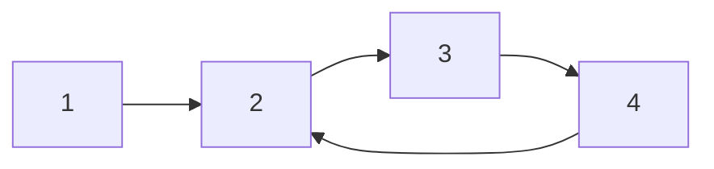
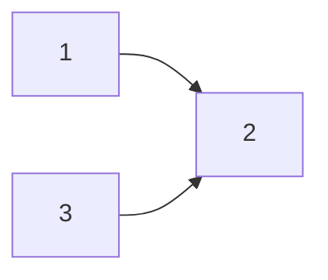
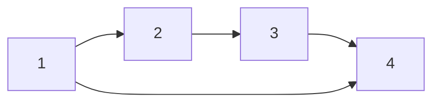
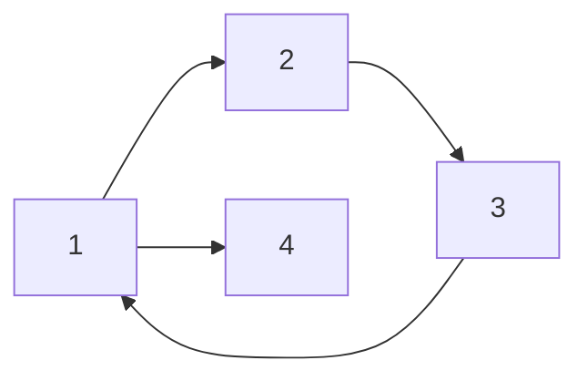

# Detect Cycle in Directed Graph

Given a **directed graph** represented as an adjacency list, the task is to determine if the graph contains any cycles.



## Depth-First Search (DFS) Approach

In an **undirected graph**, we use a `visited[]` array to track visited nodes and detect if a node is revisited while doing depth first search thus indicating a cycle. However, this approach does not work for directed graphs because nodes can be visited multiple times from different paths and yet count of multiple visit to a same node won't indicate the presence of a cycle.

For example, consider the following graph:



Here, node **2** can be visited twice \(1 \rightarrow 2 \) and \(3 \rightarrow 2\), however a simple DFS keeping the track of visited nodes cannot indicate the presence of a cycle.

### Observing Sub-Graphs

A directed graph can be seen as a collection of sub-graphs. In the graph above, there are two sub-graphs: `1 → 2` and `3 → 2`. Running a cycle detection algorithm independently on each sub-graph will detect cycles for that particular sub-graph. Once the algorithm is complete for one sub-graph, we can unmark all the nodes which were visisted in one sub-graph and prepare them for a revisit again from another sub-graph.

While this approach works, it is inefficient as it repeatedly runs DFS on nodes where the checks were already done previously.

### Optimized DFS Algorithm

We can optimize the above approach by:

1. Initializing the `visited[]` array once.
2. Introducing a `processed[]` array to track sub-graphs already checked for cycles.

<iframe width="560" height="315" src="https://www.youtube.com/embed/rKQaZuoUR4M?si=05lyPM9W4ia4Uazk" title="YouTube video player" frameborder="0" allow="accelerometer; autoplay; clipboard-write; encrypted-media; gyroscope; picture-in-picture; web-share" referrerpolicy="strict-origin-when-cross-origin" allowfullscreen></iframe>

Here’s the code:

=== "Java"

    ```java linenums="1"
    public class DetectCycleUsingDFS {

        public static void main(String[] args) {
            // Example: 0 -> 1 -> 2 -> 0 (cycle)
            int totalNodes = 4;
            int[][] edges = {
                    {0, 1},
                    {1, 2},
                    {2, 0},
                    {2, 3}
            };

            System.out.println(detectCycle(totalNodes, edges)); // expected: true

            // Example: DAG diamond, no cycle
            int[][] noCycleEdges = {
                    {0, 1},
                    {0, 2},
                    {1, 3},
                    {2, 3}
            };
            System.out.println(detectCycle(4, noCycleEdges)); // expected: false
        }

        public static boolean detectCycle(int totalNodes, int[][] edges) {
            // visited[node]  = true once a node has been fully explored (all its
            //                  descendants processed) -> safe to skip forever.
            // onStack[node]  = true while the node is on the current DFS
            //                  recursion path -> revisiting it means a back-edge,
            //                  i.e. a cycle.
            boolean[] visited = new boolean[totalNodes];
            boolean[] onStack = new boolean[totalNodes];

            List<Integer>[] graph = new ArrayList[totalNodes];
            for (int node = 0; node < totalNodes; ++node) {
                graph[node] = new ArrayList<>();
            }
            for (int[] edge : edges) {
                int u = edge[0];
                int v = edge[1];
                graph[u].add(v);
            }

            for (int node = 0; node < totalNodes; ++node) {
                // try every node as a start node (handles disconnected graphs)
                if (!visited[node]) {
                    if (detectCycleInSubGraph(node, graph, visited, onStack)) {
                        return true;
                    }
                }
            }
            return false;
        }

        private static boolean detectCycleInSubGraph(int node, List<Integer>[] graph,
                                                    boolean[] visited, boolean[] onStack) {
            visited[node] = true;
            onStack[node] = true;

            for (int nbrNode : graph[node]) {
                if (onStack[nbrNode]) {
                    // neighbor is an ancestor on the current path -> back-edge -> cycle
                    return true;
                } else if (visited[nbrNode]) {
                    // already fully explored in a previous DFS tree/branch, safe to skip
                    continue;
                } else if (detectCycleInSubGraph(nbrNode, graph, visited, onStack)) {
                    return true;
                }
            }

            // done exploring this node's subtree, remove it from the current path
            onStack[node] = false;
            return false;
        }
    }
    ```


## Breadth-First Search (BFS) Approach

To understand the BFS-based approach, it’s essential to first understand [topological sorting](#topological-sorting-algorithm) of directed graphs. 

Consider the graph below:



This graph can be viewed as a dependency graph, where if you want to processing node `1` then it can be seen that it requires prior processing of nodes `2` and `4` first. Now, if we go on to process node `2` then we can also see that it then require processing of node `3` which then again require processing of node `4`. Hence in order to process node `1` we have to go in processing order as follows: \(4 \rightarrow 3 \rightarrow 2 \rightarrow 1\). This order is know is **topological order** of the graph.

Topological sorting can only be applied to directed graph as the order is only specified in this type of graph.

### Topological Sorting Algorithm

Topological sorting processes nodes in decreasing order of their **in-degrees**. Below is the algorithm to print the topological order of a directed graph.

<iframe width="560" height="315" src="https://www.youtube.com/embed/eL-KzMXSXXI?si=bONoNQPjo5M_WLd1" title="YouTube video player" frameborder="0" allow="accelerometer; autoplay; clipboard-write; encrypted-media; gyroscope; picture-in-picture; web-share" referrerpolicy="strict-origin-when-cross-origin" allowfullscreen></iframe>

=== "Java"

    ```java linenums="1"
    public class TopologicalSorting {
        public static void topologicalSortPrint(int totalNodes, int[][] edges) {
            // initialization
            ArrayDeque<Integer> queue = new ArrayDeque<>();
            int[] indegrees = new int[totalNodes];
            List<Integer>[] graph = new ArrayList[totalNodes];

            for (int node = 0; node < totalNodes; ++node) {
                graph[node] = new ArrayList<>();
            }

            for (int[] edge : edges) {
                int from = edge[0];
                int to = edge[1];
                indegrees[to]++;
                graph[from].add(to);
            }

            for (int node = 0; node < totalNodes; ++node) {
                if (indegrees[node] == 0) {
                    queue.offer(node); // starting node
                }
            }
            // ------

            while(queue.size() > 0) {
                int currNode = queue.poll();
                System.out.println(currNode + " ");
                for (int nbrNode : graph[currNode]) {
                    indegrees[nbrNode]--;
                    if (indegrees[nbrNode] == 0) {
                        queue.offer(nbrNode);
                    }
                }
            }
        }
    }
    ```


### Khan's Algorithm for Cycle Detection

There is an interesting observation that can be made. Let's suppose the graph looks like this:



We can see that a cycle exist in the graph (\(1 \rightarrow 2 \rightarrow 3 \rightarrow 1\)) and also conclude that no matter how we process this graph, topological sort can never exist.

Khan's algorithm is a modification of the topological sorting algorithm. By counting the nodes processed, we can determine if the graph contains a cycle. If the count of processed nodes equals the total number of nodes in the graph, it implies the absence of cycles otherwise the cycle exist.

=== "Java"

    ```java linenums="1"
    public class TopologicalSortingCycleDetection {
        public boolean detectCycle(int n, int[][] edges) {
            int[] indegrees = new int[n];
            List<Integer>[] graph = new ArrayList[n];
            
            // Initialize graph
            for (int i = 0; i < n; i++) {
                graph[i] = new ArrayList<>();
            }
            
            // Build graph and compute in-degrees
            for (int[] edge : edges) {
                int from = edge[0];
                int to = edge[1];
                indegrees[to]++;
                graph[from].add(to);
            }
            
            Queue<Integer> queue = new LinkedList<>();
            int count = 0;
            
            // Add nodes with 0 in-degree to queue
            for (int i = 0; i < n; i++) {
                if (indegrees[i] == 0) {
                    queue.offer(i);
                    count++;
                }
            }
            
            // Process nodes
            while (!queue.isEmpty()) {
                int curr = queue.poll();
                for (int nbr : graph[curr]) {
                    indegrees[nbr]--;
                    if (indegrees[nbr] == 0) {
                        queue.offer(nbr);
                        count++;
                    }
                }
            }
            
            return count != n; // If count != n, cycle exists
        }
    }
    ```

#### Related Problems

1. [Leetcode - 207. Course Schedule](https://leetcode.com/problems/course-schedule/description/)
2. [Leetcode - 2392. Build a Matrix With Conditions](https://leetcode.com/problems/build-a-matrix-with-conditions/description/)