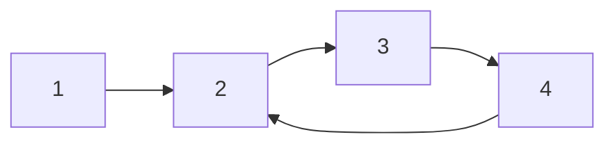
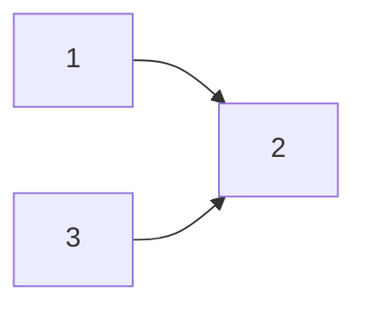
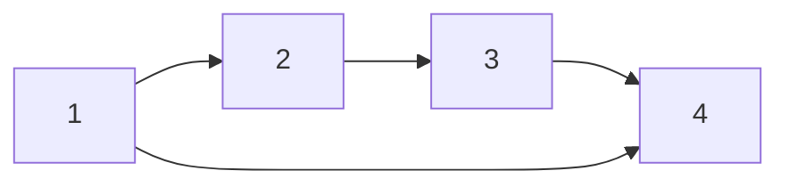

# Detect Cycle in Directed Graph

Given a **directed graph** represented as an adjacency list, the task is to determine if the graph contains any cycles.



## Depth-First Search (DFS) Approach

In an **undirected graph**, we use a `visited[]` array to track visited nodes and detect if a node is revisited, indicating a cycle. However, this approach does not work for directed graphs because nodes can be visited multiple times from different paths. 

For example, consider the following graph:



Here, node **2** can be visited twice, but that does not imply the presence of a cycle.

### Observing Sub-Graphs

A directed graph can be seen as a collection of sub-graphs. In the graph above, there are two sub-graphs: `1 → 2` and `3 → 2`. Running a cycle detection algorithm independently on each sub-graph will detect cycles. For instance:

```py
for (each node in graph):
    new visited[];
    if (detectCycle(node, visited, graph)):
        return true;
```

While this approach works, it is inefficient as it repeatedly initializes the `visited[]` array and performs redundant checks.

### Optimized DFS Algorithm

We can optimize the approach by:
1. Initializing the `visited[]` array once.
2. Introducing a `processed[]` array to track sub-graphs already checked for cycles.

Here’s the code:

```py
def detectCycle(graph):
    visited = [False] * len(graph)
    processed = [False] * len(graph)

    for node in range(len(graph)):
        if not processed[node]:
            if detectCycleUtil(node, graph, visited, processed):
                return True

    return False

def detectCycleUtil(node, graph, visited, processed):
    visited[node] = True
    processed[node] = True

    for nbr in graph[node]:
        if visited[nbr]:  # Cycle detected
            return True
        elif detectCycleUtil(nbr, graph, visited, processed):
            return True

    visited[node] = False
    return False
```

- **`visited[]`**: Tracks nodes visited in the current DFS traversal.
- **`processed[]`**: Tracks sub-graphs already checked for cycles.

## Breadth-First Search (BFS) Approach

To understand the BFS-based approach, it’s essential to first understand **topological sorting** for directed graphs. Consider the graph below:



This graph can be viewed as a dependency graph, where processing node `1` requires processing nodes `2`, `3`, and `4` first. The topological order of the graph reflects this dependency.

### Topological Sorting Algorithm

Topological sorting processes nodes in decreasing order of their **in-degrees**. Below is the algorithm to print the topological order of a directed graph:

```py
def topological_sort(graph):
    indegrees = [0] * len(graph)

    # Compute in-degrees of all nodes
    for node in range(len(graph)):
        for nbr in graph[node]:
            indegrees[nbr] += 1

    queue = []
    for node in range(len(graph)):
        if indegrees[node] == 0:  # Add nodes with 0 in-degree
            queue.append(node)

    while queue:
        n = queue.pop(0)
        print(n)  # Process node
        for nbr in graph[n]:
            indegrees[nbr] -= 1  # Decrement in-degree
            if indegrees[nbr] == 0:
                queue.append(n)
```

### Khan's Algorithm for Cycle Detection

Khan's algorithm is a modification of the topological sorting algorithm. By counting the nodes added to the queue, we can determine if the graph contains a cycle. If the count of processed nodes equals the total number of nodes in the graph, it implies the absence of cycles.

```py
def detect_cycle(graph):
    indegrees = [0] * len(graph)

    # Compute in-degrees of all nodes
    for node in range(len(graph)):
        for nbr in graph[node]:
            indegrees[nbr] += 1

    queue = []
    count = 0

    for node in range(len(graph)):
        if indegrees[node] == 0:
            queue.append(node)
            count += 1

    while queue:
        n = queue.pop(0)
        for nbr in graph[n]:
            indegrees[nbr] -= 1
            if indegrees[nbr] == 0:
                queue.append(nbr)
                count += 1

    return count != len(graph)
```

- **If `count == len(graph)`**: No cycle exists.
- **If `count != len(graph)`**: A cycle is present.

#### Related Problems 📕

1. [Leetcode - 207. Course Schedule](https://leetcode.com/problems/course-schedule/description/)
2. [Leetcode - 2392. Build a Matrix With Conditions](https://leetcode.com/problems/build-a-matrix-with-conditions/description/)