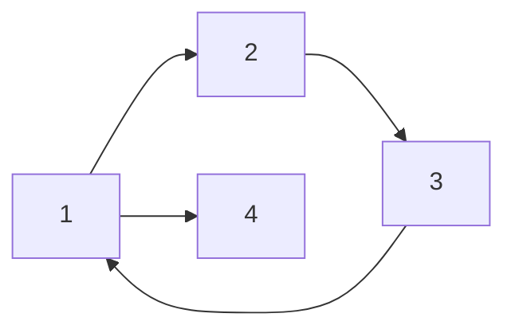

# Detect Cycle in Directed Graph

Given a **directed graph** represented as an adjacency list, the task is to determine if the graph contains any cycles.


## Depth-First Search (DFS) Approach

In an **undirected graph**, we use a `visited[]` array to track visited nodes and detect if a node is revisited while doing depth first search thus indicating a cycle. However, this approach does not work for directed graphs because nodes can be visited multiple times from different paths and yet count of multiple visit to a same node won't indicate the presence of a cycle.

For example, consider the following graph:


Here, node **2** can be visited twice \(1 \rightarrow 2 \) and \(3 \rightarrow 2\), however a simple DFS keeping the track of visited nodes cannot indicate the presence of a cycle.

### Observing Sub-Graphs

A directed graph can be seen as a collection of sub-graphs. In the graph above, there are two sub-graphs: `1 → 2` and `3 → 2`. Running a cycle detection algorithm independently on each sub-graph will detect cycles for that particular sub-graph. Once the algorithm is complete for one sub-graph, we can unmark all the nodes which were visisted in one sub-graph and prepare them for a revisit again from another sub-graph.

While this approach works, it is inefficient as it repeatedly runs DFS on nodes where the checks were already done previously.

### Optimized DFS Algorithm

We can optimize the above approach by:

1. Initializing the `visited[]` array once.
2. Introducing a `processed[]` array to track sub-graphs already checked for cycles.

Here’s the code:

=== "Python"

    ```py linenums="1"
    def detectCycle(graph):
        visited = [False] * len(graph)
        processed = [False] * len(graph)

        for node in range(len(graph)):
            if not processed[node]:
                if detectCycleUtil(node, graph, visited, processed):
                    return True

        return False

    def detectCycleUtil(node, graph, visited, processed):
        visited[node] = True
        processed[node] = True

        for nbr in graph[node]:
            if visited[nbr]:  # Cycle detected
                return True
            elif detectCycleUtil(nbr, graph, visited, processed):
                return True

        visited[node] = False
        return False
    ```

## Breadth-First Search (BFS) Approach

To understand the BFS-based approach, it’s essential to first understand [topological sorting](#topological-sorting-algorithm) of directed graphs. 

Consider the graph below:


This graph can be viewed as a dependency graph, where if you want to processing node `1` then it can be seen that it requires prior processing of nodes `2` and `4` first. Now, if we go on to process node `2` the we can also see that it then require processing of node `3` which then again require processing of node `4`. Hence in order to process node `1` we have to go in processing order as follows: \(4 \rightarrow 3 \rightarrow 2 \rightarrow 1\). This order is know is **topological order** of the graph.

### Topological Sorting Algorithm

Topological sorting processes nodes in decreasing order of their **in-degrees**. Below is the algorithm to print the topological order of a directed graph.

=== "Java"

    ```java linenums="1"
    public class TopologicalSorting {
        public void sort(int n, int[][] edges) {
            int[] indegrees = new int[n];
            List<Integer>[] graph = new ArrayList[n]; 

            for (int[] edge : edges) {
                int from = edge[0];
                int to = edge[1];
                indgrees[to]++;
                if (graph[from] == null) {
                    graph[from] == new ArrayList<>();
                }
                graph[from].add(to);
            }

            Queue<Integer> queue = new LinkedList<>();
            for (int i = 0; i < n; ++i) {
                if (indegrees[i] == 0) {
                    queue.add(i);
                }
            }

            while (queue.size() > 0) {
                int curr = queue.poll();
                // process curr here
                for (int nbr : graph[curr]) {
                    indegrees[nbr]--;
                    if (indegrees[nbr] == 0) {
                        queue.add(nbr); // process 0 indegree nodes
                    }
                }
            }
        }
    }
    ```
=== "Python"

    ```py linenums="1"
    def topological_sort(graph):
        indegrees = [0] * len(graph)

        # Compute in-degrees of all nodes
        for node in range(len(graph)):
            for nbr in graph[node]:
                indegrees[nbr] += 1

        queue = []
        for node in range(len(graph)):
            if indegrees[node] == 0:  # Add nodes with 0 in-degree
                queue.append(node)

        while queue:
            n = queue.pop(0)
            print(n)  # Process node
            for nbr in graph[n]:
                indegrees[nbr] -= 1  # Decrement in-degree
                if indegrees[nbr] == 0:
                    queue.append(n)
    ```


### Khan's Algorithm for Cycle Detection

There is an interesting observation that can be made. Let's suppose the graph looks like this:



We can see that a cycle exist in the graph and also conclude that no matter how we process this graph, topological sort can never exist!

**Khan's algorithm** is a modification of the topological sorting algorithm. By counting the nodes added to the queue, we can determine if the graph contains a cycle. If the count of processed nodes equals the total number of nodes in the graph, it implies the absence of cycles.

=== "Python"

    ```py linenums="1"
    def detect_cycle(graph):
        indegrees = [0] * len(graph)

        # Compute in-degrees of all nodes
        for node in range(len(graph)):
            for nbr in graph[node]:
                indegrees[nbr] += 1

        queue = []
        count = 0

        for node in range(len(graph)):
            if indegrees[node] == 0:
                queue.append(node)
                count += 1

        while queue:
            n = queue.pop(0)
            for nbr in graph[n]:
                indegrees[nbr] -= 1
                if indegrees[nbr] == 0:
                    queue.append(nbr)
                    count += 1

        return count != len(graph)
    ```


#### Related Problems

1. [Leetcode - 207. Course Schedule](https://leetcode.com/problems/course-schedule/description/)
2. [Leetcode - 2392. Build a Matrix With Conditions](https://leetcode.com/problems/build-a-matrix-with-conditions/description/)