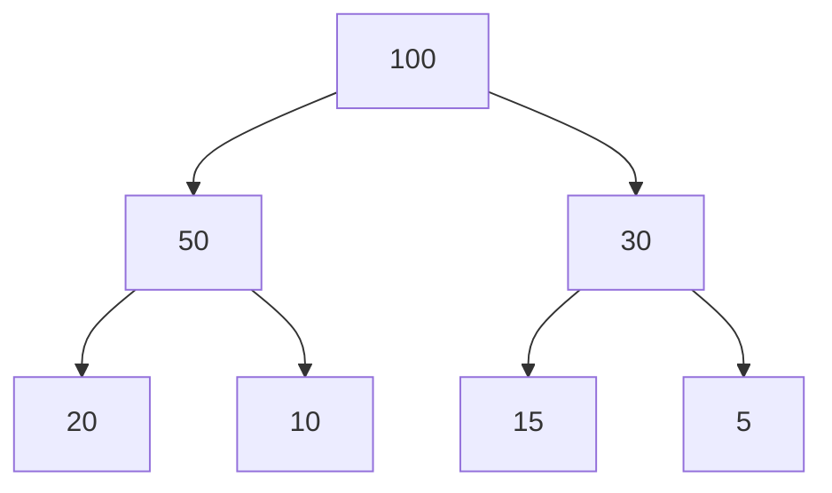

# Priority Queue (Max/Min Heap)

A heap is a complete binary tree in which each node in the tree starting from root has value strictly greater than or less than children node's value. An example is shown below which shows **max-heap** which is a heap where the parent node has strictly greater value than it's child nodes.



**Priority Queue** is a queue data structure where values are dequeued based on the priority of the elements. The priority can be decided based on the weight or value of the element or some other factor if the element is complex.

Heap lets us implement priority queue based on the value of the nodes. If the priority is decided by the value of the element then if the elements are to be dequeued based on maximum value first we implement a Max-Heap and if the elements have to be dequeued based on minimum value first then Min-Heap.

Here is an code that we can use to code a priority queue of all the three kinds: min, max and custom.
The lamda function is a custom comparator class.

=== "Java"

    ```java linenums="1"
    class PriorityQueueUsage {
        public static void main(String[] args) {
            // max-heap or max priority queue
            PriorityQueue<Integer> maxHeap = new PriorityQueue<>();
            queue.add(1);
            queue.add(2);

            // min-heap or min priority queue
            PriorityQueue<Integer> minHeap = new PriorityQueue<>((p1, p2) -> {
                return -Integer.compare(p1, p2);
            });

            // custom comparator priority queue
            PriorityQueue<CustomClass> customHeap = new PriorityQueue<>((p1, p2) -> {
                return Integer.compare(p1.val, p2.val); // val is a integer attribute
            });
        }
    }
    ```
