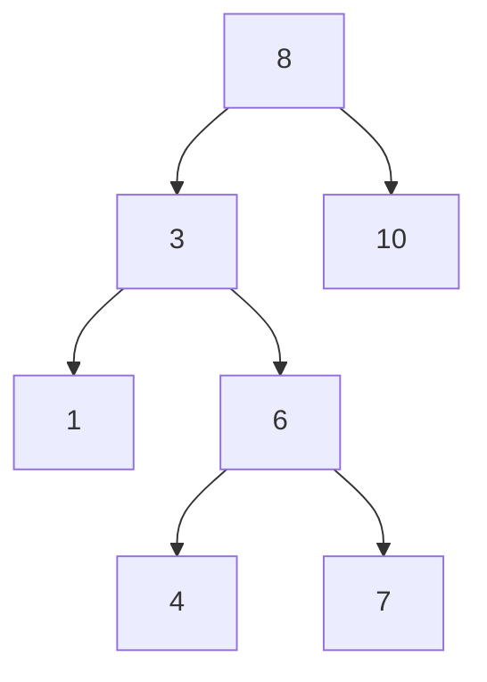

# Binary Search Tree



A binary search tree is a tree where the left child of the tree is always smaller and the right child of the subtree is always greater than the current node. This subsequently prove that on a given root, the left subtree will have children having value lesser than the current root and on the right subtree the children will have greater value than the current root node.

## Inorder Traversal

Inorder traversal of a BST will result in accessing the nodes of the tree in an ascdending order of their values. This is crucial in problems where we have to access the order of the nodes in a particular fashion.

## Insertion in a BST

=== "Java"

    ```java linenums="1"
    public class BST {
        public root insert(TreeNode root, int val) {
            if (root == null) {
                return new TreeNode(val);
            }
            if (root.val > val) {
                root.left = insert(root.left, val);
            } else {
                root.right = insert(root.right, val);
            }
            return root;
        }
    }
    ```

## Deletion in a BST

=== "Java"

    ```java linenums="1"
    public class BST {
        public root delete(TreeNode root, int val) {
            if (root == null) {
                // node is not found
                return null;
            }
            if (root.left == null && root.right == null) {
                // node is found but is leaf node
                return null;
            }
            if (root.val == val) {
                if (heightOf(root.left) > heightOf(root.right)) {
                    // find the previous value in in-order traversal
                    TreeNode predecessor = findPredecessor(root.left);
                    root.val = predecessor.val;
                    root.left = delete(root.left, predecessor.val); // delete the previous value
                } else {
                    // find the next value in the in-order traversal
                    TreeNode successor = findSuccessor(root.right);
                    root.val = successor.val;
                    root.right = delete(root.right, successor.val); // delete the next value
                }
            }
        }

        public int heightOf(TreeNode root) {
            if (root == null) {
                return 0;
            }
            if (root.left == null && root.right == null) {
                return 1;
            }
            return 1 + Math.max(heightOf(root.left), heightOf(root.right));
        }

        public TreeNode findSuccessor(TreeNode root) {
            TreeNode ptr = root.right;
            while (ptr.left != null) {
                ptr = ptr.left;
            }
            return ptr;
        }

        public TreeNode findPredessor(TreeNode root) {
            TreeNode ptr = root.left;
            while (ptr.right != null) {
                ptr = ptr.right;
            }
            return ptr;
        }
    }
    ```