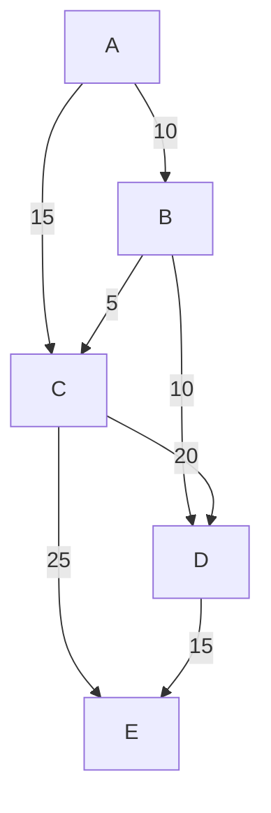
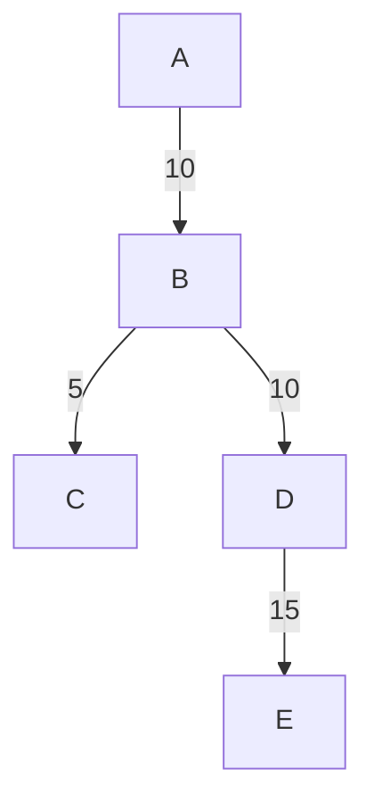

## Union-Find Algorithm for Disjoint Set

**Initialization of parents and ranks**:

=== "Java"

    ```java linenums="1"
    class UnionFind {
        public void initialize(int[] parents, int[] ranks) {
            int N = parents.length;
            for (int i = 0; i < N; ++i) {
                parents[i] = i;
                ranks[i] = 0;
            }
        }
    }
    ```

**Find algorithm**:

=== "Java"

    ```java linenums="1"
    class UnionFind {
        public int find(int x, int[] parents) {
            if (parents[x] == x) {
                return x;
            }
            return find(parents[x], parents);
        }
    }
    ```

**Find Algorithm with Path compression**:

Why Path compression? Because ultimately we want to reach the root parent of the tree. What if we set the root parent directly for the given element? This way we don't have to traverse the tree to find the root parent.

=== "Java"

    ```java linenums="1"
    class UnionFind {
        public int find(int x, int[] parent) {
            if (x == parent[x]) {
                return x;
            }
            parent[x] = find(parent[x], parent); // path compression
            return parent[x];
        }
    }
    ```

**Union Algorithm**:

=== "Java"

    ```java linenums="1"
    class UnionFind {
        public void union(int x, int y, int[] parents) {
            int parentX = find(x, parents);
            int parentY = find(y, parents);

            if (parentX == parentY) {
                return;
            }

            parent[parentY] = parentX;
        }
    }
    ```

**Union by Rank Algorithm**:

Why do we need the ranking? Because with simple Union operation, a chain is formed that takes O(n) time to find the parent in the worst case and then unionize two elements.

=== "Java"

    ```java linenums="1"
    class UnionRankFind {
        public void union(int x, int y, int[] parents, int[] ranks) {
            int parentX = find(x, parents);
            int parentY = find(y, parents);

            if (parentX == parentY) {
                return;
            }

            if (ranks[parentX] > ranks[parentY]) { // union based on ranking
                parents[parentY] = parentX;
            } else if (ranks[parentY] > ranks[parentX]) {
                parents[parentX] = parentY;
            } else {
                parents[parentY] = parentX;
                ranks[parentX]++;
            }
        }
    }
    ```

## Kruskal's Algorithm

With Kruskal's algorithm we find the Minimum Spanning Tree of any Graph. A MST is a graph which has the minimum number of least costly edges which can create a connected graph. In a Kruskal's algorithm we are given an array of edges along with their weights and asked to return an array of edges that are required to create a MST.

**For the given graph below:**



**The MST is as follows:**


**Kruskal's Algorithm**:

=== "Java"

    ```java linenums="1"
    class Kruskals {
        // Edge: [src, dest, cost]
        public List<Edge> kruskalsAlgorithm(Edge[] edges, int totalNodes) {
            List<Edge> mst = new ArrayList<>();
            int totalProcessedNode = 1;
            int[] parent = new int[totalNodes];
            int[] rank = new int[totalNodes];
            for (int i = 0; i < totalNodes; ++i) {
                parent[i] = i;
            }

            Arrays.sort(edges, (e1, e2) -> e1[2] - e2[2]); // sorting array based on cost
            for (int i = 0; i < edges.length && totalProcessedNodes != totalNodes; ++i) {
                Edge e = edges[i];
                int src = e[0];
                int dest = e[1];
                if (find(src, parent) == find(dest, parent)) {
                    continue; // ignore if edge was already added
                }
                totalProcessedNode++;
                union(src, dest, parent, rank);
                mst.add(e);
            }
            return mst;
        }

        private void union(int src, int dest, int[] parent, int[] rank) {
            if (find(src, parent) == find(dest, parent)) {
                return;
            }
            parSrc = find(src, parent);
            parDest = find(dest, parent);
            if (rank[parSrc] > rank[parDest]) {
                parent[parDest] = parSrc;
            } else if (rank[parDest] > rank[parSrc]) {
                parent[parSrc] = parDest;
            } else {
                parent[parDest] = parSrc;
                rank[parSrc]++;
            }
        }

        private int find(int src, int[] parent) {
            if (src == parent[src]) {
                return src;
            }
            parent[src] = find(parent[src], parent);
            return parent[src];
        }
    }
    ```