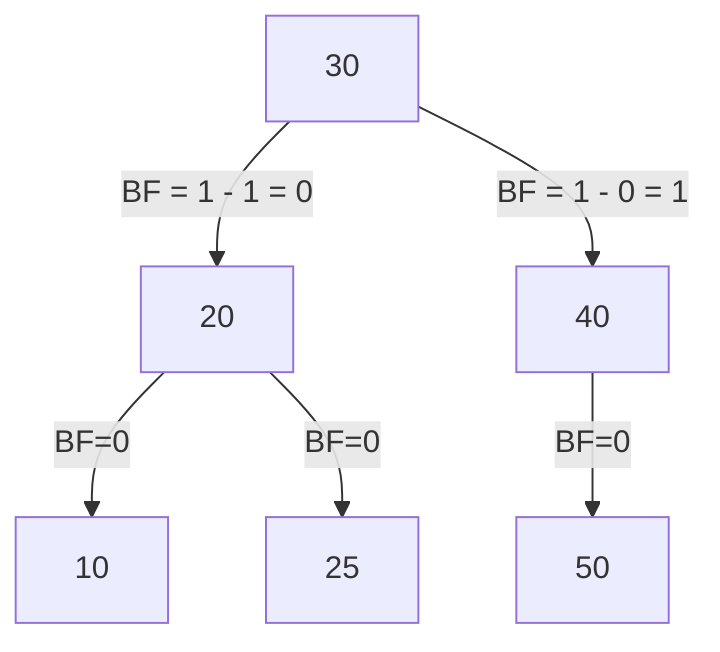

# Adelson-Velsky and Landis (AVL) Tree

## Definition

The BST tree when converted to a height balanced tree then it becomes an AVL Tree. **Balancing factor** of a tree node is the difference between the heights of the left and right sub tree.

For a tree to be height-balanced the factor should belong to a value in the set \(\{1, 0, -1\}\). More specifically the absolute difference of heights of right and left subtree must be either \(0\) or \(1\).

## Inserting in AVL
