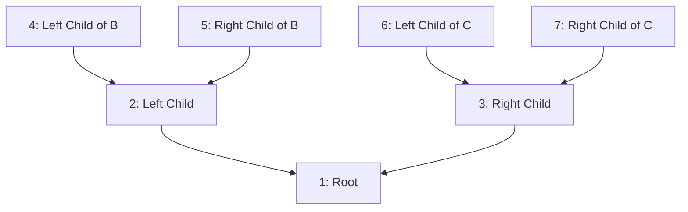

# Heap Indexing

Heap indexing is a technique used to calculate the position of any node during a level-order traversal of a binary tree. This approach is particularly useful in problems where the structure of the tree needs to be analyzed, such as determining the maximum width of a binary tree.

## Problem Example

Consider the following problem:

> [Maximum Width of Binary Tree](https://leetcode.com/problems/maximum-width-of-binary-tree/)

In this problem, the goal is to find the maximum width at any level of the tree between two nodes. The challenge is that null nodes may exist between two nodes at any level.

## Visualization

Below is a sample binary tree diagram to illustrate heap indexing:



This diagram shows the indexing of nodes in a binary tree during a level-order traversal. Each node is labeled with its index, calculated using the heap indexing formula.

### Formula

The problem can be solved using the following formula:

$$\text{Max_Width} = L_e - L_s + 1$$

Where, $L_{e}$ is the index of the last node at a level and $L_{s}$ is the index of the first node at a level.

## Algorithm

To calculate the index of nodes during a level-order traversal, the following algorithm can be used:

=== "Java"

    ```java linenums="1"
    public class BinaryTreeWidth {
        public int getMaxWidth(TreeNode root) {
            if (root == null) return 0;

            Queue<Pair> queue = new ArrayDeque<>();
            queue.add(new Pair(root, 1)); // Start with root at index 1
            int maxWidth = 0;

            while (!queue.isEmpty()) {
                int size = queue.size();
                int levelStartIndex = 0, levelEndIndex = 0;

                for (int i = 0; i < size; i++) {
                    Pair current = queue.poll();
                    TreeNode node = current.node;

                    if (i == 0) levelStartIndex = current.index; // First node in the level
                    if (i == size - 1) levelEndIndex = current.index; // Last node in the level

                    if (node.left != null) {
                        queue.add(new Pair(node.left, current.index * 2)); // Left child index
                    }
                    if (node.right != null) {
                        queue.add(new Pair(node.right, current.index * 2 + 1)); // Right child index
                    }
                }

                maxWidth = Math.max(maxWidth, levelEndIndex - levelStartIndex + 1); // Update max width
            }

            return maxWidth;
        }
    }

    class Pair {
        TreeNode node;
        int index;

        Pair(TreeNode node, int index) {
            this.node = node;
            this.index = index;
        }
    }
    ```
